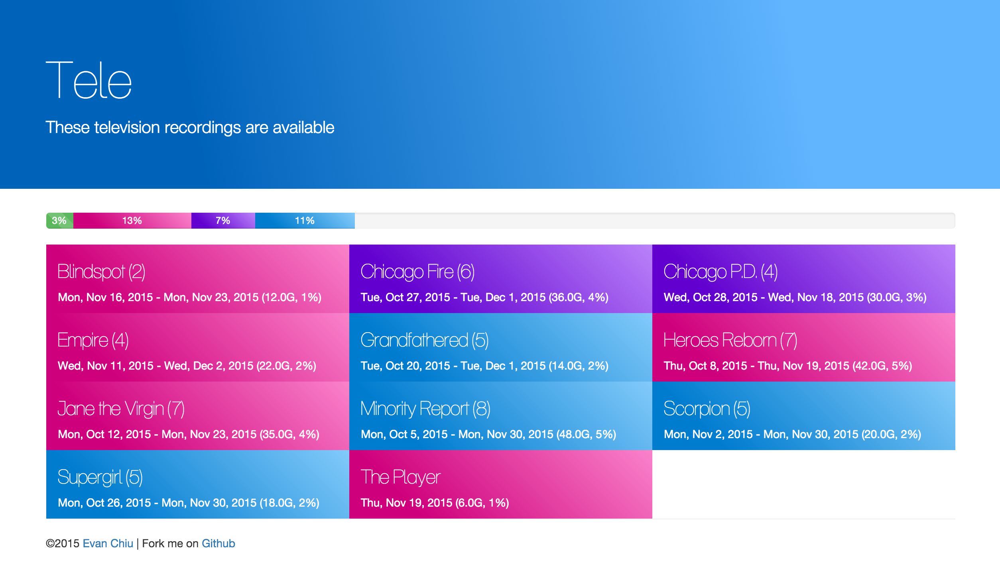

# Tele
A simple web app for displaying recorded television shows.

## Sample Screenshot

## Web app setup
The web app is pretty simple.  It just reads a directory listing on the local network, parses the content, and displays the shows available.
* Clone this repo to a directory where the PHP files will be interpreted on the host
* Edit `config.php`
* Browse to `index.php`

## My Setup
Tele is also is my name for a Windows VM set up to:
* Record DVR Content
* Provide that content to the XBox as a Media Center Extender

I run into a lot of trouble setting it up because I like to run it as a headless VM on my linux server.  This allows me to give it tons of hard drive space for saving those recordings, and saves me from running another server box.  The problem is that Windows Media Center has DRM protection issues and wants to make sure your PC is powerful enough to play that TV without issue.

### Host Setup
* I'm running Elementary OS 0.3.1: Freya x64
* Install graphics drivers - I have an AMD Trinity APU (CPU/GPU)
  * Grabbing the latest (non-beta) Catalyst driver and running it on linux happened without issue
* Install Oracle VirtualBox
* Ideally, I’d start the VM on startup of the host.  Launching it headless doesn’t work on my setup.

### Windows Setup
* Create a Windows 7 x64 VM
* Get it fully updated (currently about 5-10 reboots and more updates)
* Download [HDHomeRun Software](http://my.hdhomerun.com/instructions/)
  * Install it and run it to find the tuners on your network and configure Windows to recognize them
  * Make sure Windows is treating this as a Home network
* Follow [Windows Media Center Instructions](http://my.hdhomerun.com/instructions/software-instructions/wmc.php)
* If Digital Cable Advisor fails, you may need to [override](http://www.missingremote.com/guide/override-digital-cable-advisor-windows-media-center-7) it
* Install Cygwin so that the PC can be remotely administered over command line
  * Net / OpenSSH Server
* Install [node.js](https://nodejs.org/en/)
  * Install [http-server](https://www.npmjs.com/package/http-server)
    * `npm install -g http-server`
  * Make an empty directory named `empty` in your home directory for monitoring without exposing your files
  * Go to Task Scheduler and set up two tasks
    * Show Listings
      * Trigger: At startup
      * Run a program: `http-server`
      * Arguments: `"C:\Users\Public\Recorded TV" -p 1077`
      * Uncheck configuration to kill it after 3 days
    * Monitor Listing
      * Trigger: At startup
      * Run a program: `http-server`
      * Arguments: `"C:\Users\Users\evan\empty" -p 10077`
      * Uncheck configuration to kill it after 3 days

### Monitoring Setup
* I set up monitoring, so I know when this thing goes down
* In your router
  * Give the tele vm a static IP
  * Set up port forwarding for the port serving an empty directory
* In [UptimeRobot](https://uptimerobot.com/)
  * Monitor that port
